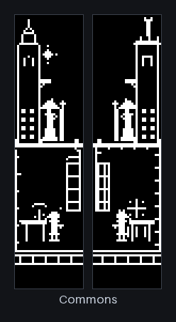
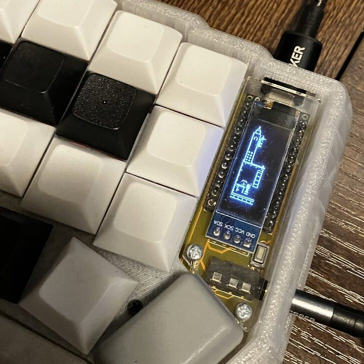
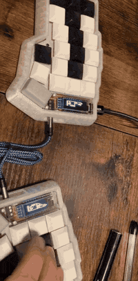

# Corne Arcane

A deterministic spell-duel world that lives on a Corne split keyboard's two
OLEDs. Type normally; the way you type casts spells.


A fixed-tick simulation runs on the master half at 25 Hz. Key *positions*,
never keycodes and never characters, feed a combat model with elemental
residue, field effects, wards, and aftermath that persists across duels. Both
displays render live state from a 32-byte snapshot crossing the TRRS link. The
slave half never recomputes the world, it only draws what it is sent.

## Beneath the duel is a city

There are eight districts: Commons, Research, Workshop, Observatory,
Scriptorium, Studio, Arena, and Undercroft. Each has a room, a resident who
works in it, and two architectural voices, curved and astral on the left half,
squared and mechanical on the right.



The keyboard is complete offline. An optional Linux daemon adds the city: it
tells the keyboard what kind of thing you are doing, in enums and counters
only, and the tower changes floor around you.

Which row you type on picks the element. How varied the burst is decides the
form, the size, and how strong a ward you are holding while you type it. A
pause commits the spell. [`docs/duel.md`](docs/duel.md) covers all of it, and
[`docs/glossary.md`](docs/glossary.md) defines the vocabulary.

## Three ways in


### 1. See it without a keyboard

The whole simulation, renderer, and 622-scene visual catalog build and run
natively. No hardware, no QMK checkout:

```bash
make test                                               # mechanics, visuals, allocation, host
firmware/sim_test/visual_runner --dump-pgm /tmp/frames   # every scene as an image
python3 tools/contact_sheet.py /tmp/frames sheet         # contact sheets to page through
python3 tools/figures.py /tmp/frames docs/images         # the figures on this page
```

That is the fastest way to see what this actually looks like.

### 2. Put it on the keyboard

You need a Corne (crkbd rev1) with RP2040 controllers and both OLEDs, plus a
[Vial-QMK](https://github.com/vial-kb/vial-qmk) checkout at the revision in
[`VIAL_QMK_REVISION`](VIAL_QMK_REVISION).

```bash
git clone https://github.com/vial-kb/vial-qmk ~/src/vial-qmk
git -C ~/src/vial-qmk checkout "$(cat VIAL_QMK_REVISION)"
./host/install_firmware.sh        # syncs firmware/ into the QMK tree
make release-build                # UF2 + ELF + map, with resource budgets
```

`firmware/` is the source of truth; it is a keymap, not a standalone tree.

Then follow [`docs/flashing.md`](docs/flashing.md). The bootloader entry on
this board is less obvious than usual, and there is one rule about TRRS that
will cost you hardware if you get it wrong.

<table>
<tr>
<td></td>
<td></td>
</tr>
</table>

### 3. Optional: the desktop daemon

The keyboard is complete without it. The daemon reports what *kind* of thing
has focus, so the tower shows a Workshop while you write code, an Arena while
you play something, an Observatory during a Pomodoro.

It reports enums, counters, durations, and salted digests. Not window titles,
URLs, file paths, command lines, notification bodies, or typed text. None of
those enter retained state or either wire protocol, and that is a property of
how the code is built, not something a filter strips out later. See [`host/README.md`](host/README.md) for what each adapter can
and cannot see.

Install on NixOS by importing [`corne.nix`](corne.nix); on Debian or Ubuntu
build the package with `dpkg-buildpackage -b -uc -us`. Both drive one install
layout defined in [`host/Makefile`](host/Makefile), so they cannot drift apart.

```bash
corne-arcane-event browser scroll 1              # send one activity event by hand
corne-arcane-diagnostics --observe 300 --json    # watch live metrics
corne-arcane-vial                                # launch Vial for keymap edits
```

Vial, diagnostics, and the daemon share one Raw HID endpoint, so
`corne-arcane-vial` hands it over and restores the previous service state
afterward. Use it instead of launching Vial directly.

If focus never seems to change anything, you probably have no focus producer:
KWin and GNOME Shell report from inside the compositor, but a plain X11 session
needs the opt-in `corne-arcane-focus-x11` service.

## How it works


Two design commitments run through all of it. The simulation is
deterministic. Fixed ticks, integer math, no allocation, and no time reads
inside mechanics mean a given input sequence always produces the same frames,
which is why a catalog of exact framebuffer hashes can be a test. And privacy is structural: the host
normalizes to bounded enums before anything is retained, so there is no code
path that could leak content even if something upstream misbehaved.

- How casting works, in depth: [`docs/duel.md`](docs/duel.md)
- Vocabulary: [`docs/glossary.md`](docs/glossary.md)
- Data flow, ownership, and invariants: [`docs/architecture.md`](docs/architecture.md)
- The two 32-byte wire layouts, bit by bit: [`docs/protocol-ledger.md`](docs/protocol-ledger.md)
- Build, test, format, review goldens: [`docs/development.md`](docs/development.md)
- Flashing and recovery: [`docs/flashing.md`](docs/flashing.md)
- Host daemon and adapters: [`host/README.md`](host/README.md)
- NixOS specifics: [`BUILD_NOTES_NIXOS.md`](BUILD_NOTES_NIXOS.md)
- Where the images come from: [`docs/images/README.md`](docs/images/README.md)
- Patching this, and the one rule about goldens: [`CONTRIBUTING.md`](CONTRIBUTING.md)
- Deferred product work: [`docs/backlog.md`](docs/backlog.md)

## License

[GPLv2](LICENSE). The firmware is a derivative work of
[Vial-QMK](https://github.com/vial-kb/vial-qmk) (itself derived from
[QMK Firmware](https://github.com/qmk/qmk_firmware)), so the whole firmware,
including the custom spell-duel simulation and rendering modules, is licensed
under the GNU General Public License v2. Images are covered by the same
licence; see [`docs/images/README.md`](docs/images/README.md).
