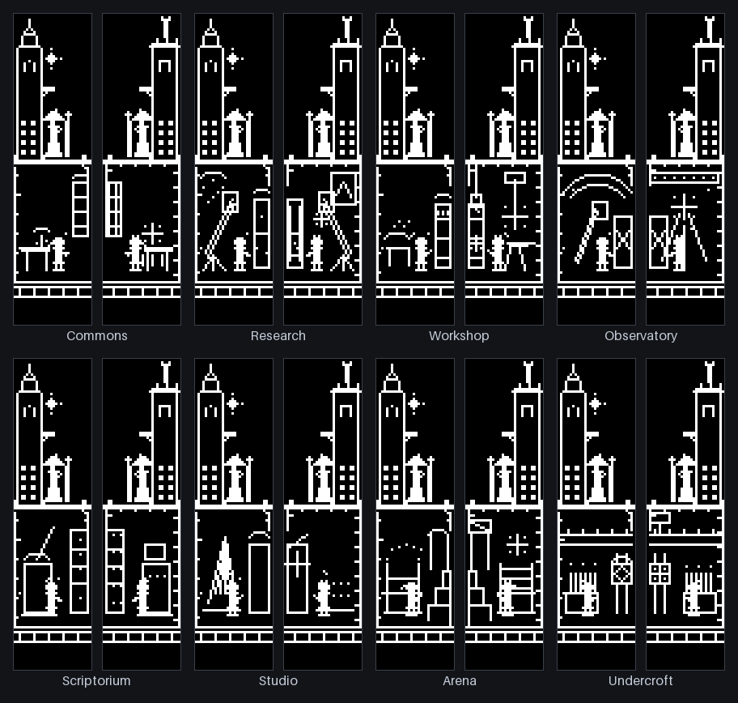

# Architecture

Corne Arcane has one authoritative simulation and two local presentation
surfaces. The master half decides mechanics; the slave half never reconstructs
or advances authoritative world state. Both halves draw locally from bounded
projections, so the split carries state, not pixels.


## Firmware data flow

```text
physical matrix
    │
    ├─> ordinary QMK key output
    │
    └─> sampled positions + bounded edge queue
             │
             v
       master sim_tick (25 Hz)
             │
             ├─> model -> view -> split snapshot v13 -> slave presentation
             │
             ├─> render projection -> scene compositor -> local OLED
             │
             └─> world-owned RGB policy
```

`keymap.c` owns hardware integration, wall-clock sampling, split transport, and
OLED/RGB hooks. It supplies physical positions, not keycodes or text, to
`duel_sim.c`. The simulation orchestrator preserves the fixed phase order
declared in `duel_sim_internal.h`. `duel_incantation.c` owns collection and
descriptor compilation; `duel_combat.c` owns damage, wards, collision, motion,
status, residue, fields, derived magic signatures, echo/bloom, aftermath, and
lifecycle mechanics. Stable layouts and enum values live in `duel_model.h`.

`duel_view.c` creates the canonical presentation projection. `duel_proto.c`
packs that view plus synchronized presentation state into the split snapshot.
The slave validates version, ranges, reserved bits, and CRC before accepting a
snapshot; it does not derive a world from the packet.

Rendering proceeds through `duel_render_t`. `duel_framebuffer.c` owns clipped
1bpp pixels, lines, and mirrored desk-space geometry. Environment, combat, and
overlay drawing are isolated in their respective modules; `duel_draw.c` owns
only full-scene composition order. Resident, courier, and event derivation
depend on civic/render/framebuffer contracts, never on the compositor.

Each district resolves to a room and a resident, drawn in one of two
architectural voices: astral on the left canvas, mechanical on the right.
A rare event lands on one of its district's own objects, so one family reads
differently in each room. A courier's arrival, the first half of a cheer, a
wonder, a panic or a fire, and a local rare event that gathers the room each
bring two bystanders beside the resident, outside a quiet town and the
Observatory: three figures at most, derived from the frame with no crowd
record. URGENT flashes the beacon on the peak twice,
300 ms apart, then rests about fifteen seconds on the civic clock; STRAIN stands
a steady hazard sign on the balcony.
Both canvases below are renderer output for the same district:



## Host data flow

```text
desktop adapters + explicit event command
                 │
                 v
       privacy-bounded semantic state
                 │
                 v
         Raw HID v3 heartbeat
                 │
                 v
        master disposable context
                 │
                 v
          split v13 propagation
```

`dbus_contract.py` owns public names, paths, interfaces, XML, methods, and
repository-state values. `dbus_services.py` implements the public services.
`adapters.py` is pure semantic policy; `dbus_adapters.py` owns monitoring,
property unpacking, reconnects, and fail-soft integration. `runtime.py` owns
GLib deadlines, wake coalescing, polling, semantic revision detection,
heartbeat dispatch, and deterministic cleanup. `daemon.py` only constructs
dependencies, acquires the bus, and starts the runtime.
The desktop city app (`city_window.py`, installed as `corne-arcane`) is a client
of the running service: it reads the Control interface's link status and the
world bytes the heartbeat carries, and never opens the keyboard.
The renderer's input (`duel_city_input_t` in `desktop/duel_city.h`, ABI 11) is
those payload bytes unpacked, then seven off-keyboard signals: typing tempo,
spread, top row and row share from the opt-in typing summary, and body
activity, heart mood and sleep mood reduced on a watch. Each is a small enum
whose zero means none. After them come the season from the shell's calendar
and three day tallies the shell keeps and passes back in, the casts, impacts
and knockdowns its world has counted today; the library stores none of it, so
the same seed and inputs give the same world. Nothing draws the season. Last
come six host signals: presence, load, strain, call, alert and command, the
daemon's opt-in `--host-signals` producers at finer detail than the wire folds
them into mode and intensity (load in six steps, which resource is near full,
ringing apart from joined, a critical notice apart from a call, one long
command apart from several). The daemon publishes them as enums on Control's
`HostSignalsChanged` only while `--host-signals` is on; the `HostSignals`
method answers all none without it. Only the desktop city fills them, and
nothing draws them. They pass only from a shell to its renderer; neither wire
protocol carries them. With the ambient world, the shared civic derivation runs
as the master's does: a rare event needs both champions standing, and the
diplomatic courier is weighted by the balance the world's knockdowns tip.

The town and landscape layouts draw the typing four: tempo is the spire's
pennant, spread the chimney smoke, top row the height of a lit lantern on the
tower, and row share how many lanterns hang. They also draw the health three
as mood, never as a reading: body activity is kites over the town, one up per
activity ring closed; heart mood is the windmill on the hill, furled when
still and turning when lively; and last night's sleep is who sits on the roof
ridge, a cockerel or a sleeping cat. On the square, body activity sets how many
residents are out and a short night sits some of them down. The hashed
walkers a shell gets when it passes no town life (below) also walk at the
typing tempo and step quicker after a full night; the residents keep their own
pace.

The tower is cut away to three storeys: the one the host is on, drawn tall and
lit, and the floors above and below it, with a loft and a cellar at the ends.
The tall storey is the district's own room, drawn with the same two
silhouettes the panels use for it: a hearth and a table for the Commons, a
telescope and a specimen cabinet for Research, a bench, an alembic and a barrel
for the Workshop, an orb and a glass for the Observatory, shelves and a lectern
for the Scriptorium, a harp and a prism for the Studio, a roped ring and a
stepped stand for the Arena, and pipes, a lever bank and a stop valve for the
Undercroft. The Observatory's glass tilts higher and finds one more star at
each of four stages of the civic intensity, as the panels' instrument does; on
the watch the intensity follows the body bucket, so the stage moves through the
day. URGENT lights the beacon over the spire twice, 300 ms apart, then rests
about fifteen seconds, on the same civic-clock schedule as the panels' beacon,
so the town and the keyboard flash together. STRAIN stands a steady hazard sign
on the balcony; when the desktop service also says which resource is near full
(the ABI 10 strain signal), a plaque on the sign's post names it, a chip for the
CPU, a stack of bars for memory, a platter for the disk. QUIET darkens the near
row's windows and thins the square.

The street at the foot of the near row reads the civic bytes the panels read.
A notification's courier walks in from its own city's edge of the town, left or
right: it waits two-thirds of the way in, stands at the tower door once the
notice is old, and walks back out when it resolves. Its hat and load name its
kind (a messenger's letter, a carter's crates, a lamp-bearer's lantern, a
sentinel's halberd), and how much it carries shows the notification count in
three steps: one, a few, many. A rare
event happens on its side of the town: a scroll streams off a roof, the gable
clock's gear jams, a bench and a kettle come out for a break, or a crack opens
down the end house, each drawn differently as it arms, happens, is put right and
leaves its trace. A diplomatic courier hangs banners from the balcony on the
side it favours, or both, and the civic sky is an aurora behind the spire.
While an aftermath lasts it owns those bytes: the courier and the event stand
down, a resident for each champion stands on its side of the tower door at the
task the aftermath sets, and the spell's flavor hangs as a sigil beside the
spire.

The square's residents have lives of their own (`desktop/duel_town_life.c`,
desktop only). Twelve residents with four needs -- rest, work, food and company
-- walk a small graph of places: the doors of the near row's houses, the smithy
and the tavern among them, the well, the market, a bench, the tower's foot, the
open square, and a gate off either edge. Each picks the need that presses most,
goes to the nearest place with room that serves it, stays until it is met, and
decides again. Night sends them home, a quiet town keeps them in, and a spell in
flight stops the curious and sends the nervous indoors. The state is a
caller-owned 384-byte `duel_town_life_t` beside `duel_ambient_t`, integer-only,
allocation-free, and advanced on the 300 ms civic tick. The module reads only a
small struct of bounded bytes that the city glue fills from the host semantics,
the ambient world and the sky clock, worked out for every tick; it never
receives the projection, so nothing it does can reach the civic bytes the
keyboard derives. Shells call `duel_city_life_advance` wherever they advance the
world and pass the handle to `duel_city_render`, and the desktop window, the
browser and CityKit all do so by default. The town and landscape draw the
residents from it; a NULL handle draws hashed walkers crossing the square
instead. The same seed and inputs replay the residents exactly.

The day's tallies go up on an almanac board in the square: a spark for casts,
a heart for impacts and a fallen figure for knockdowns, each with a stroke at
1, 4, 16 and 64 and a fifth across the gate when the byte is full. They are
steps, not counts, because the world casts hundreds of spells an hour. A day
with nothing in it draws no board.
The four panel layouts are the keyboard's own screens and draw none of the
off-keyboard signals, the almanac or the residents.

Every Raw HID write is a request/response exchange. A valid VIA echo must arrive
before the next heartbeat is scheduled. A timeout, mismatch, short read, or
device error closes the transport and begins rediscovery with a fresh session.
Vial shares that endpoint, so `corne-arcane-vial` performs an exclusive,
state-preserving service handoff. Diagnostics use the same ownership guard for
single reads and observation windows, restoring only a service that was active
beforehand. Their separate diagnostics-only v2 protocol does not accept or
provide compatibility with the prior production Raw HID v2.

Zsh, Bash, and Fish hooks emit only monotonic duration, integer exit status,
normalized repository state, and an argument-free "still running" call for a
command past ten seconds. KWin, the opt-in GNOME extension, and the
opt-in X11 producer report only application/desktop identifiers; the X11
producer reads a single window property and cannot name a title-bearing one.
The opt-in Sway and Hyprland producers report only the matched profile. Sway's
sends only a seat query and `nop` probes that answer match or no match, and
Hyprland's sends one fixed `repl` request that returns the window class. Neither
can ask for the window tree or open the event stream, which carry titles, so
compositors that offer nothing narrower get no producer. The optional Firefox bridge carries only
browser event kind and intensity; it has no URL, title, history, content, form,
referrer, or typed-text channel. Missing buses, extensions, permissions, or
native hosts disable only their adapter.

## Invariants

- Authority: only the master advances combat and shared world state. The slave
  renders validated projections.
- Determinism: simulation uses fixed 40 ms ticks, integer math, explicit state,
  fixed phase ordering, and no time reads inside mechanics.
- Allocation: firmware simulation, encoding, and rendering allocate no memory.
  Event storage stays caller-visible to avoid a second stack copy.
- Privacy: host inputs are normalized to enums, counters, flags, and salted
  digests. Titles, bodies, commands, paths, URLs, filenames, and typed text do
  not enter retained semantic state or either wire protocol. The opt-in typing
  helper for keyboards without this firmware keeps raw key events inside its
  own process; only a four-enum summary per 60-second window leaves it, to the
  desktop city alone ([`typing-summary.md`](typing-summary.md)).
- Timing: host state expires after 1.5 seconds; heartbeat and reconnect timing,
  display sleep, 25 Hz simulation, and 20-second HP regeneration are contracts.
- Protocols: production Raw HID v3 and split v13 are exactly 32 bytes. The
  diagnostics-only v2 reports are three 32-byte pages with an 18-byte reverse
  split reply. Versions, enum values, packing, reserved bits, CRC coverage, and
  stale fallback are stable.
- Stale link: invalid or absent split traffic selects safe local presentation.
  The next valid snapshot replaces synchronized state directly, without replay.
- Power: only physical key activity wakes OLED and RGB surfaces. Host or
  background-world changes do not wake sleeping hardware.

## Dependency direction

Dependencies point from integration toward pure contracts:

```text
QMK glue -> runtime/protocol/render entry points
sim orchestration -> model + incantation + private combat phases
view/protocol -> model (never drawing)
scene compositor -> render + framebuffer + drawing subsystems
drawing subsystems -> render + framebuffer + civic/view contracts
host daemon -> runtime -> services/adapters/heartbeat -> pure semantic/protocol policy
```

Lower layers must not include QMK, GLib, D-Bus, hidraw, or compositor details.
Protocol and model headers must not depend on drawing. Presentation modules may
read projections but must not decide mechanics. Any exception should be treated
as an architectural change and reviewed against the invariants above.
