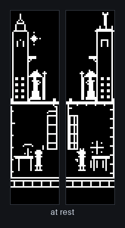
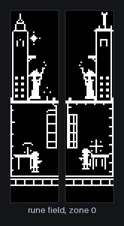

# Images

## Generated from the renderer

`duel.png`, `districts.png`, `rooms.gif`, `spells.gif`, and `fields.gif` are
produced by [`tools/figures.py`](../../tools/figures.py) from the visual
catalog. Nothing in them is drawn by hand, so a figure cannot drift away from
what the firmware actually renders. Regenerate after a deliberate visual
change and review the result the way a contact sheet is reviewed:

```bash
firmware/sim_test/visual_runner --dump-pgm /tmp/frames
python3 tools/figures.py /tmp/frames docs/images
```

Every scene named in those figures is a case in the committed catalog. The
animations hold one case per frame; they are a tour of the catalog, not a
recording of the simulation running, and no frame is interpolated or edited.

A catalog frame is 67x128 — the left canvas, a separator, then the right
canvas. Each canvas is one physical 32x128 OLED, so a figure showing two
panels is showing both halves of the keyboard.

For the district figures the left canvas comes from the astral case and the
right canvas from the mechanical one, because the catalog exercises the two
architectural voices as separate cases. On hardware both halves render the
same district at the same time, which is what the composition shows.

### The catalog, in motion

Combat, across the elements and the ward:



Field effects filling their zones:



## Captured from hardware

`hardware.jpg` is a crop of a photograph of the running keyboard.
`hardware-live.gif` is a short excerpt of a video of the same session,
reduced in size and frame rate.

Both are derived from local captures that are not in version control. All
camera, timestamp, and location metadata was stripped before the originals
were kept, and again on the files here; the source video carried location
data, so anything further derived from that session must be checked before it
is published.

## Drawn by hand

`architecture.svg` and `setup.svg` are hand-authored SVG. They are text, so
they diff like source. Both carry their own dark background rather than
relying on the reader's theme, which keeps them legible next to the renderer
figures in either GitHub theme.

## Licence

Everything here is covered by the repository's [GPLv2](../../LICENSE). The
generated figures are output of GPLv2 firmware source; the photograph, the
animation taken from it, and the two diagrams are the author's own work,
released under the same licence as the rest of the repository.
